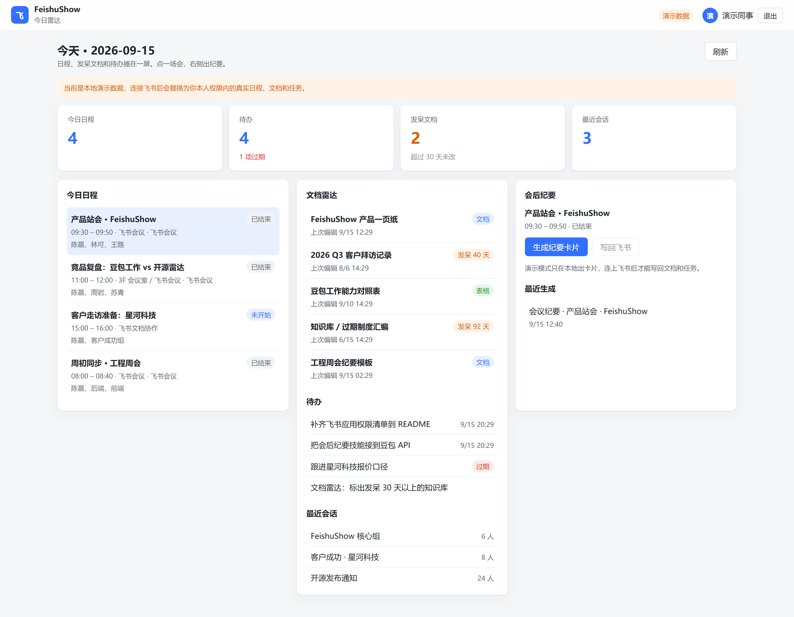
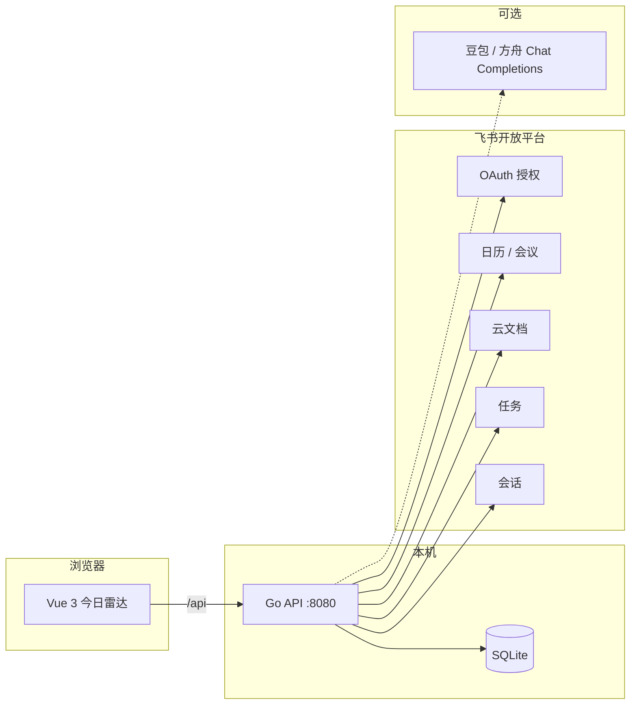
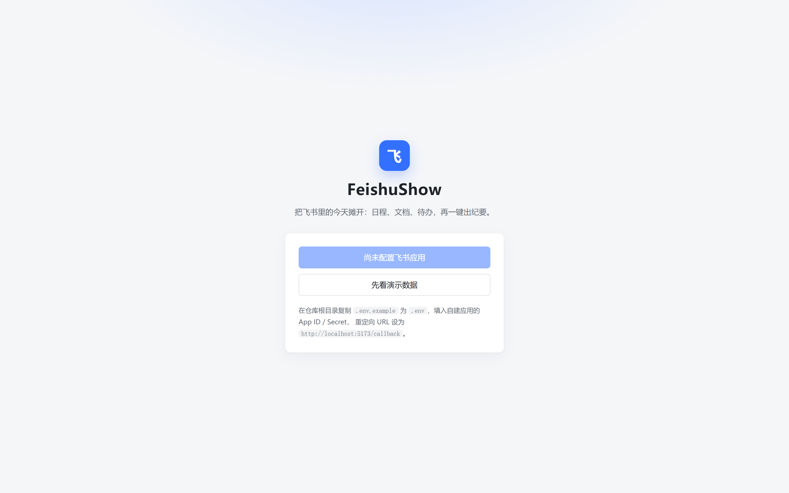
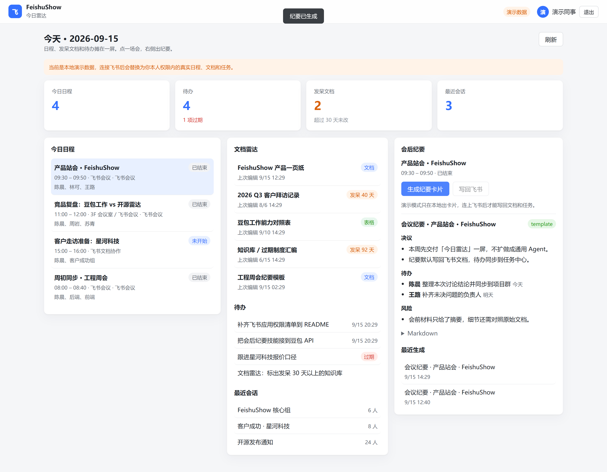

# FeishuShow

把飞书里的今天摊开：日程、发呆文档、待办，点一场会就能出纪要。

[](https://go.dev/)
[](https://vuejs.org/)
[](LICENSE)

<p align="center">
  
</p>

<p align="center">
  <sub>演示数据一屏：4 场日程 · 1 项过期待办 · 2 份超过 30 天没改的文档。点左侧一场会，右侧出决议 / 待办 / 风险。</sub>
</p>

豆包工作已经把「会干活的 Agent」占满了。FeishuShow 不做第二个通用 Agent，只做官方产品不强调的那一层：**先看清自己的飞书，再按你选的模型把一场会收干净。** 没开通企业豆包也能用；开了也可以并排用。

| | 豆包工作 / 工作伙伴 | FeishuShow |
| --- | --- | --- |
| 定位 | 闭源 Agent，拆任务、出 PPT、操作电脑 | 开源工作雷达，把今天摊开给你看 |
| 入口 | 企业管理员开通 | 自己建应用，五分钟先看演示 |
| 数据 | 走字节云端 | 本地 SQLite，权限继承你本人 |
| 模型 | 绑定豆包 | 可选。不配也能出纪要，配了 `DOUBAO_API_KEY` 再润色 |

- 仓库：[github.com/showx/FeishuShow](https://github.com/showx/FeishuShow)
- 当前版本：v0.1（今日雷达 + 会后纪要）

## 目录

- [它能做什么](#它能做什么)
- [架构](#架构)
- [环境要求](#环境要求)
- [教程一：五分钟跑通演示](#教程一五分钟跑通演示)
- [教程二：接入真实飞书](#教程二接入真实飞书)
- [教程三：用豆包润色纪要](#教程三用豆包润色纪要)
- [日常怎么用](#日常怎么用)
- [配置说明](#配置说明)
- [权限与安全](#权限与安全)
- [接口一览](#接口一览)
- [排障](#排障)
- [目录结构](#目录结构)
- [路线图](#路线图)
- [许可](#许可)

## 它能做什么

- **今日雷达** — 今天的日程、未完成任务、最近文档、最近会话，一屏看完
- **发呆文档** — 超过 30 天没改过的知识标出来，避免知识库 silently 腐烂
- **会后纪要** — 选一场会，生成决议 / 待办 / 风险卡片；演示模式只落本地，连上飞书可写回云文档和任务中心
- **本人权限** — 用 `user_access_token` 调用开放平台，读到的范围不超过你在飞书里本来就能看到的
- **模型可选** — 默认本地模板；配置火山方舟兼容接口后，用豆包润色同一张卡片

单项 API 失败不会整页挂掉：缺权限时该栏显示空列表，并在顶部给出明确警告。

## 架构



登录有两条路，互不影响：

1. **演示模式**：不请求飞书，写入本地演示账号，看板数据按当天动态生成
2. **飞书 OAuth**：跳转 `accounts.feishu.cn`，用授权码换 `user_access_token`，再按本人权限拉今日数据

## 环境要求

| 依赖 | 版本 | 说明 |
| --- | --- | --- |
| Go | 1.21+ | 后端 |
| Node.js | 18+ | 前端 |
| 浏览器 | 现代 Chromium / Edge | 访问 `http://localhost:5173` |
| 飞书自建应用 | 可选 | 教程二才需要 |
| 火山方舟 API Key | 可选 | 教程三才需要 |

Windows / macOS / Linux 都可以。下面命令以仓库根目录为准。

## 教程一：五分钟跑通演示

这一步**不需要**飞书应用。先确认界面和纪要链路是通的，再决定要不要接真实租户。

### 1. 克隆并启动后端

```bash
git clone https://github.com/showx/FeishuShow.git
cd FeishuShow

cd backend
go mod tidy
go run .
```

终端出现：

```text
FeishuShow API 已启动 http://localhost:8080
未配置飞书应用，可先用演示模式
```

保持这个窗口不要关。

### 2. 另开终端启动前端

```bash
cd frontend
npm install
npm run dev
```

终端出现 `Local: http://localhost:5173/`。

### 3. 进入演示

浏览器打开 http://localhost:5173

<p align="center">
  
</p>

此时「用飞书账号登录」是灰的，这是预期——还没配 App ID。点 **先看演示数据**。

### 4. 验收今日雷达

进入后应能同时看到：

- 顶部徽章为「演示数据」
- 四张统计卡：今日日程 / 待办 / 发呆文档 / 最近会话
- 左侧日程带「已结束 / 未开始 / 进行中」
- 中间有标了「发呆 30+ 天」的文档，以及至少一条过期待办
- 顶部有一条橙色提示：当前是本地演示数据

如果四张卡全是 0 且没有橙色提示，说明后端没起来，或前端代理没打到 `8080`。回到步骤 1。

### 5. 验收会后纪要

1. 左侧点一场 **已结束** 的会
2. 右侧点 **生成纪要卡片**
3. 等待出现决议、待办、风险；来源标签为 `template`
4. **写回飞书** 在演示模式不可用，这是预期

<p align="center">
  
</p>

演示跑通，说明前后端、登录态、纪要技能都正常。接下来才值得花时间配飞书。

## 教程二：接入真实飞书

目标：登录按钮变成「用飞书账号登录」，看板换成你本人权限内的真实日程和文档。

> 全程使用**用户身份**（`user_access_token`），不使用应用身份去扫全公司数据。管理员审核时可以把这一点写进申请理由。

### 步骤 1：创建企业自建应用

1. 打开 [飞书开发者后台](https://open.feishu.cn/app)，用**要试用的那个飞书账号**登录
2. 点击 **创建企业自建应用**
3. 名称填 `FeishuShow`，描述可写：`本地开源工作雷达，只读取授权用户本人的日程、文档和任务`
4. 创建完成后进入应用，打开 **凭证与基础信息**，复制：
   - **App ID**（形如 `cli_xxx`）
   - **App Secret**（点击「显示」后再复制）

不要把 App Secret 提交进 Git。仓库里的 `.env` 已被忽略。

开发阶段建议同时打开 **测试企业和人员**（应用后台左侧常见入口）：测试版权限即时生效，不必每次等管理员审。正式给同事用时，再切回正式版并走发布审核。

### 步骤 2：配置重定向 URL

OAuth 回调地址必须和代码里的 `FEISHU_REDIRECT_URI` **逐字符一致**，包括协议、端口、路径，不能多 `/`。

1. 左侧进入 **开发配置 → 安全设置**
2. 在 **重定向 URL** 中添加：

```text
http://localhost:5173/callback
```

3. 点击添加，确认列表里出现这一条

常见翻车：

| 写错的值 | 结果 |
| --- | --- |
| `http://localhost:5173/callback/` | 多斜杠，飞书拒绝跳转 |
| `http://127.0.0.1:5173/callback` | 和 `localhost` 不是同一个 URL |
| `http://localhost:8080/callback` | 这是 API 端口，前端收不到 `code` |
| `https://localhost:5173/callback` | 本地 Vite 是 http |

改完重定向 URL 通常立即生效，不必发版。但下面的 API 权限必须开通。

### 步骤 3：申请 API 权限

进入 **开发配置 → 权限管理 → 开通权限**。按「权限名称」搜索后勾选。只要雷达和纪要，不要一次开通通讯录全量读写。

**只读（看板必需）**

| 权限 | 开通时的显示名（以控制台为准） | 用途 |
| --- | --- | --- |
| `offline_access` | 获取用户的离线访问权限 | 刷新 `user_access_token` |
| `auth:user.id:read` | 获取用户 userid | 识别当前登录人 |
| `calendar:calendar:readonly` | 获取日历、日程及忙闲信息 | 今日日程 |
| `drive:drive:readonly` | 获取云空间信息 | 最近文档 / 发呆检测 |
| `docx:document:readonly` | 查看新版文档 | 读取文档元数据 |
| `task:task:read` | 查看任务 | 待办列表 |
| `im:chat:readonly` | 获取群组信息 | 最近会话 |

**写回（要点「写回飞书」才需要）**

| 权限 | 用途 |
| --- | --- |
| `calendar:calendar` | 为日程创建官方会议纪要（若接口可用） |
| `drive:drive` / `docx:document` | 新建纪要云文档并写入正文 |
| `task:task:write` | 把纪要里的待办写进任务中心 |

授权页拼接的 scope 与代码一致，见 `backend/feishu/oauth.go` 中的 `DefaultScopes`。控制台没开通、授权链接却带了该 scope，用户会看到错误码 **20027**。

### 步骤 4：发布版本，并把可用范围留给自己

权限勾上还不等于线上生效。

1. 打开 **应用发布 → 版本管理与发布 → 创建版本**
2. 版本号例如 `0.1.0`
3. 更新说明写：`FeishuShow 本地雷达，用户授权后只访问本人可见数据`
4. **可用范围** 先选「仅自己」或所在测试人员，不要一上来全公司
5. 保存后 **申请发布**
   - 测试企业：一般立刻可用
   - 正式企业：等管理员通过。被拒多半是权限开太多，把写权限先拿掉再提一版只读

可用范围内没有你自己时，授权页会报 **20010**（用户没有应用使用权限）。

### 步骤 5：写入本地环境变量

在**仓库根目录**（和 `README.md` 同级）复制配置：

```bash
# Windows PowerShell
Copy-Item .env.example .env

# macOS / Linux
cp .env.example .env
```

编辑 `.env`，至少填这三项（不要加引号、不要首尾空格）：

```env
FEISHU_APP_ID=cli_xxxxxxxx
FEISHU_APP_SECRET=xxxxxxxx
FEISHU_REDIRECT_URI=http://localhost:5173/callback
```

后端启动时会依次读取 `backend/.env` 和 `../.env`。推荐只维护根目录这一份。

改完 `.env` 必须**重启 Go 进程**，配置不会热更新。重启后日志应变为：

```text
飞书登录已启用，回调 http://localhost:5173/callback
```

前端刷新登录页，「用飞书账号登录」应变为可点击。仍是「尚未配置飞书应用」，说明进程读到的还是空 App ID：检查是否写在了别的目录、是否有全角字符、是否没重启。

### 步骤 6：走一遍真实登录

1. 确认后端、前端都在跑
2. 打开 http://localhost:5173 ，如已进入演示，先点右上角 **退出**
3. 点 **用飞书账号登录**
4. 浏览器跳到飞书授权页，勾选权限并同意
5. 跳回 `/callback`，短暂显示「正在完成飞书授权」，然后进入今日雷达
6. 右上角徽章应为 **已连接飞书**，名字是你的飞书昵称，不再是「演示同事」

验收真实数据：

- 有日程的日子，左侧应出现今天的会；没有会则列表为空，但统计卡仍在
- 中间文档来自你云空间最近编辑，发呆标记按「现在 − 上次编辑 ≥ 30 天」计算
- 某栏为空且顶部出现「当前账号未授权此项权限，已跳过」，回到步骤 3 补权限并**重新授权**（旧 token 不会自动带上新 scope）

### 步骤 7：用一场真会出纪要

1. 选一场已结束、你是参与人的会
2. 先点 **生成纪要卡片**，确认本地预览没问题
3. 再点 **写回飞书**（需要步骤 3 的写权限）
4. 成功时卡片上出现飞书文档链接；任务中心应多出纪要里的待办标题

写回失败但预览成功：多半是 `docx:document` / `task:task:write` 没开通，或版本未发布。卡片仍会记在本地历史里，不会因为写回失败而丢。

## 教程三：用豆包润色纪要

不配模型时，纪要来源是 `template`，按日程标题、时间、参与人、描述套本地提纲。配上豆包之后，同一按钮走 Chat Completions，来源变为 `llm`。

### 1. 准备方舟密钥

1. 打开 [火山方舟](https://console.volcengine.com/ark)（豆包 API 的企业入口）
2. 创建 API Key，并确认已开通文本模型
3. 记下 **接入点 / 模型 ID**（控制台里那个可以调 `chat/completions` 的名字）

默认按 OpenAI 兼容协议请求：

```text
POST {DOUBAO_BASE_URL}/chat/completions
Authorization: Bearer {DOUBAO_API_KEY}
```

### 2. 写入 `.env`

```env
DOUBAO_API_KEY=你的key
DOUBAO_BASE_URL=https://ark.cn-beijing.volces.com/api/v3
DOUBAO_MODEL=doubao-seed-1-6-250615
```

`DOUBAO_MODEL` 必须改成你账号里真实可用的接入点名，示例值只是占位。Key 无效或模型名写错时，服务端会回退到本地模板，卡片来源仍可能是 `template`。

### 3. 重启后端并验证

重启 `go run .` 后，再生成一张纪要：

- 成功：来源标签 `llm`，决议/待办会随会议内容变化，而不是固定那两句产品口径
- 失败回退：来源仍是 `template`。用下面命令看后端是否读到 Key（不要把完整 Key 贴到聊天里）：

```bash
# 在 backend 目录，确认进程能读到非空 Key
# Windows PowerShell
Select-String -Path ..\.env -Pattern '^DOUBAO_'
```

纪要正文不会拿去训练任何第三方；Key 只存在你本机 `.env`。

## 日常怎么用

连上飞书之后，建议的日常路径：

1. 早上打开雷达，看今天几场会、有没有过期待办
2. 扫一眼「发呆文档」，把超过 30 天没人动、但还在被引用的知识标出来
3. 会结束后点这场会 → 生成纪要卡片 → 人工改两句 → 写回飞书
4. 需要更好文风时再配豆包，不配也能交卷

演示模式可以随时用来给同事看产品形态，不必先过管理员审核。

## 配置说明

| 变量 | 默认 | 说明 |
| --- | --- | --- |
| `PORT` | `8080` | API 端口 |
| `FRONTEND_URL` | `http://localhost:5173` | CORS 回退 Origin |
| `JWT_SECRET` | 开发占位 | 正式使用请改成随机长串 |
| `DB_PATH` | `data/feishushow.db` | 相对 **backend 工作目录** |
| `FEISHU_APP_ID` | 空 | 空则只有演示登录 |
| `FEISHU_APP_SECRET` | 空 | 与 App ID 成对 |
| `FEISHU_REDIRECT_URI` | `http://localhost:5173/callback` | 必须出现在开放平台重定向列表 |
| `DOUBAO_API_KEY` | 空 | 空则只用本地纪要模板 |
| `DOUBAO_BASE_URL` | 方舟北京 `.../api/v3` | 不要带末尾 `/chat/completions` |
| `DOUBAO_MODEL` | 示例接入点名 | 改成你自己的 |

前端开发服务器把 `/api` 代理到 `http://localhost:8080`，因此浏览器只访问 5173 即可。

## 权限与安全

- 令牌存在本机 SQLite（`backend/data/feishushow.db`），不上传任何中转服务器
- 刷新令牌需要 `offline_access`；过期后会提示重新授权，不会静默扩大权限
- 看板以只读接口为主；「写回飞书」是显式按钮，演示模式直接禁用
- 不要把 `.env`、`*.db` 提交到 Git。`.gitignore` 已排除

企业管理员审核时可以用这三句话说明边界：用户授权、本人可见范围、本地部署。

## 接口一览

| 方法 | 路径 | 登录 | 说明 |
| --- | --- | --- | --- |
| `GET` | `/api/auth/status` | 否 | 是否已配飞书 / 豆包 |
| `GET` | `/api/auth/feishu/url` | 否 | 返回飞书授权 URL |
| `POST` | `/api/auth/feishu/exchange` | 否 | `{ code, state }` 换 JWT |
| `POST` | `/api/auth/demo` | 否 | 演示登录 |
| `GET` | `/api/me` | 是 | 当前用户 |
| `GET` | `/api/today` | 是 | 今日雷达 |
| `POST` | `/api/skills/minutes` | 是 | `{ eventId, calendarId, writeBack }` |
| `GET` | `/api/skills/minutes` | 是 | 本机纪要历史 |

成功响应统一为 `{ "code": 0, "data": ..., "message": "ok" }`。

## 排障

| 现象 | 原因 | 处理 |
| --- | --- | --- |
| 登录页提示无法连接后端 | 只起了 Vite，没起 Go | 先 `cd backend && go run .` |
| 按钮停在「尚未配置飞书应用」 | `.env` 没被读到 | 文件放在仓库根目录；重启 Go；确认 `FEISHU_APP_ID` 非空 |
| 授权页 20027 | scope 含控制台未申请的权限 | 权限管理补齐后重新点登录 |
| 授权页 20010 | 你不在应用可用范围 | 版本发布里把可用范围加上自己 |
| 跳回后「授权状态无效」 | `state` 过期或后端重启丢掉内存态 | 10 分钟内完成授权；不要中途重启 API |
| 回调 404 | 重定向 URL 不是前端 `/callback` | 改回 `http://localhost:5173/callback` |
| 雷达缺栏并提示未授权 | token 上没有对应 scope | 补权限、重新授权，不要沿用旧登录 |
| 写回飞书无文档链接 | 缺少文档写权限或发版未生效 | 先点「生成纪要卡片」确认预览，再补 `docx:document` |
| 纪要来源一直是 template | 没配 Key、模型名错误或方舟拒绝 | 检查 `DOUBAO_*`，看 API 进程日志 |
| 演示数据像「卡住同一天」 | 日程按本机「今天」生成 | 换一天再看；这不是缓存损坏 |

## 目录结构

```text
FeishuShow/
├── backend/                 Go API
│   ├── feishu/              OAuth 与开放平台封装
│   ├── skills/              会后纪要（模板 / 豆包）
│   ├── demo/                演示看板
│   └── data/                SQLite（本地生成，不入库）
├── frontend/                Vue 3 今日雷达
├── docs/                    README 截图
├── scripts/capture-docs.mjs 刷新 docs 截图（可选）
├── .env.example
└── README.md
```

## 路线图

v0.1 只把「今天这一屏」和「一场会的纪要」做稳。后面按痛感加，不加通用聊天窗：

- 周报草稿：本周日历 + 已完成任务 + 群摘要 → 飞书文档
- 群订阅：指定群每天一张摘要卡片
- 作为三方技能挂到豆包工作伙伴，借官方入口分发，而不是和它抢入口

## 许可

[MIT](LICENSE) © 2026 showx
